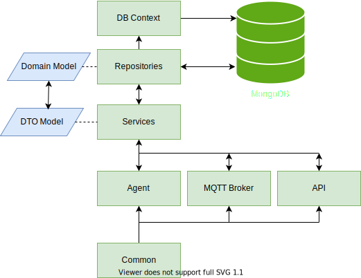
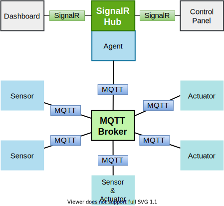

	

   	<h2 align="center">A cloud based IoT solution</h2>

IotHub provides an abstract solution of any IoT infrastructure including Broker system, API management, Authentication, Agent management system, so that it can be extended to any preferable IoT solution like  **home automation system, supply chain management**.

### Solution Structure

* **IotHub.Agent**

  A .NET web project to establish the channel between `MQTT` broker and `SignalR` broker. This agent will publish all `MQTT` broker messages to `SignalR` clients  (dashboard, control panel) and send all commands from `SignalR` clients to `MQTT` clients. Agent is using [MQTTnet](https://github.com/chkr1011/MQTTnet)  `managed client` to connect with `MQTT` broker.

* **IotHub.API**

  A .NET web API project to provide and manage all data sources of the solution. This project use.

* **IotHub.Broker**

  A .NET web project to establish a MQTT broker server. Broker is using [MQTTnet](https://github.com/chkr1011/MQTTnet) `server`.

* **IotHub.Common**

  A .NET classlib project to provide all common models, enums, exceptions and other stuffs. 

* **IotHub.DataTransferObject**

  A .NET classlib project, using to transfer data from service layer to service, controller and other service consumers.

* **IotHub.DB**

  A .NET classlib project, to provide all database context and settings. Solution is using `MongoDB` as primary database. 

* **IotHub.DomianModels**

  A .NET classlib project, to provide domain level models.

* **IotHub.Repositories**

  A .NET classlib project, to communicate with database or data source and response in domain level. Only `IotHub.Services` have the access to use repository to provide a security level to access domain models.

* **IotHub.Services**

  A .NET classlib project, to provide all common services e.g authentication service, user management service, profile management services.

    

        
    

     
  	<h6 align="center">Solution Architecture</h6>

***

    

        
    

     
  	<h6 align="center">Broker Architecture</h6>

***

### How to use (development)

Very first clone the project using `git clone https://github.com/rafiulgits/IotHub.git` or download the project by clicking on download button.

 

**Required Environments**

* .NET Core 3.1 or letter
* MongoDB

**Execution**

* Build the solution by `dotnet build`
* Go to `src/IotHub.API` and from `appSettings.json` set your internal custom credential and use this credential create some new users (including agent one) and profiles
* Run the `src/IotHub.Broker` development server by `dotnet watch run`
* Go to `src/IotHub.Agent` , set agent credentials that you created earlier  and run the development server by `dotnet watch run`

Development environment is ready to use!

To testing with MQTT clients [MQTT fx](https://mqttfx.jensd.de/index.php/download) is a good solution. See [iothub-dashboard](https://github.com/rafiulgits/iothub-dashboard) a Reactive example dashboard that will help to find out how to use IotHub solution.

***

## Full Documentations

* ### [IotHub.Agent Doc](./docs/agent_doc.md)

* ### [IotHub.Broker Doc](./docs/broker_doc.md)

* ### [IotHub.API Doc](./docs/api_doc.md)

***

## License

This repository is licensed with the [MIT](./LICENSE) license.